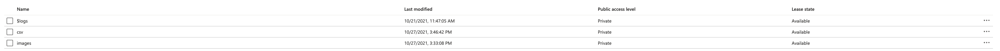

# Email Attachment Processor

<h1 align="center">
   Email Attachment Processor
</h1>


## Table of contents

- [Design](#design)

## Design

Steps

- Fetches new emails with attachments from outlook
- Stores csv type files as a new Blob in Blob Storage in 'csv' container
- Stores image type files as a new Blob in Blob Storage in 'images' container

**Logic App Design Using Logic App Designer**


**Blob Storage Structure**



Example file structure

```text
AzureStroageAccount/
└── BlobStorage/
    ├── csv/
    │   ├── examplecsv1.csv
    │   └── examplecsv2.csv
    └── images/
        ├── exampleimage1.png
        └── exampleimage2.jpeg
```
